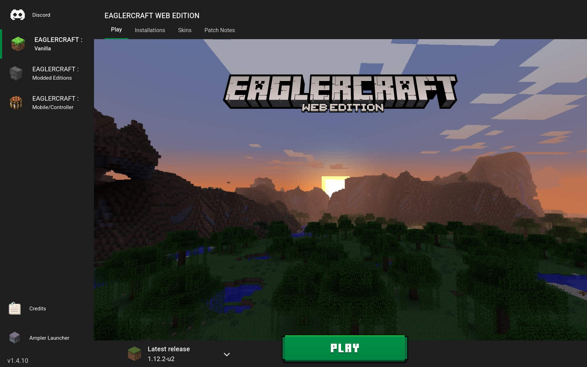

#  Eagler Launcher v1.4.3
 A minecraft themed launcher for Eaglercraft! 
 Containing some of the best clients all in one place!

 

 ## Versions
 __v1.4.3__ - Added executable apps for Linux, MacOS and Windows 
 __v1.4.2__ - Added TheCreationKing's Skin editor, Added Kone client and optimized code 
 __v1.4.1__ - Creation of Eagler launcher, removed a not working version of eaglercraft, renamed some things and added credits 
 __v1.4.0__ - Added News, bug fixes, and integrated mods! 
 __v1.3.1__ - Organized and updated code, added memory options, more games, installations, usernames, and faq screen! 
 __v1.2.0__ - Updated games. 
 __v1.1.0__ - Updated code and optimized! 
 __v1.0.0__ - Main code with future updates planned!

 

## Installation
 Currently just download the repository for the source code! 
 Future plans for an offline file may be possible!

## Features Planned

Click here to expand feature list

- [ ] Add the servers screen
- [x] Add Credits screen
- [ ] Add Settings screen
- [x] Rewrite some of the css and js
- [x] Organize code, and add comments
- [ ] Add a customizable launcher selector
- [x] Save last played game
- [x] Add FAQ screen
- [x] Add Installations screen
- [x] Add Mods screen
- [ ] Add Skins screen
- [x] Add News screen
- [ ] Fix display errors
- [ ] Offline launcher download?

## Credits
irv77:
- made the gui for Ampler Launcher, which Eagler Launcher is a fork of
- made the eaglercraft itself work in Ampler Launcher

Dutch Ducks Development:
- forked Ampler Launcher into Eagler Launcher
- removed unstable/not working features
- added these credits! (:

TheCreationKing:
- made the skin editor

